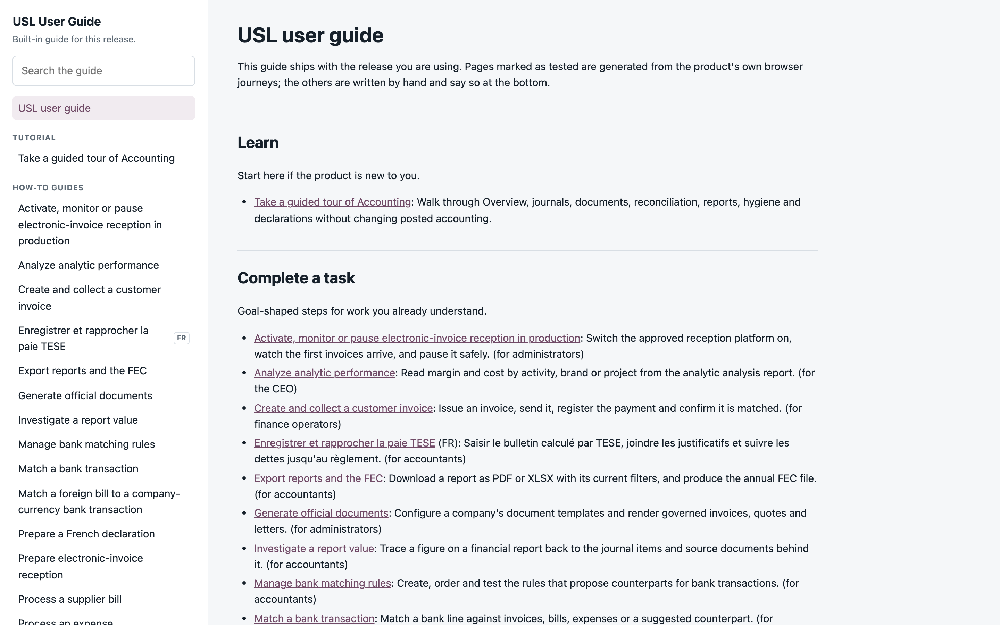
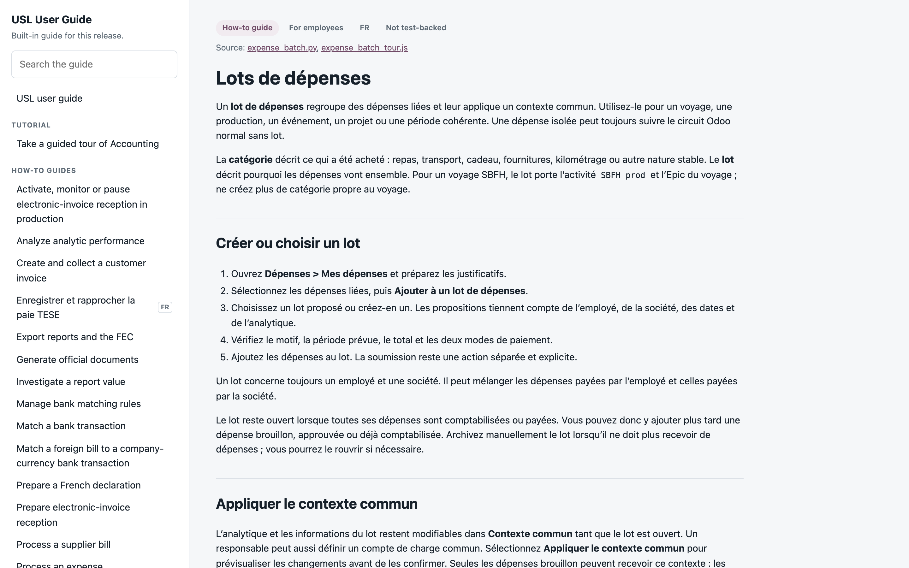
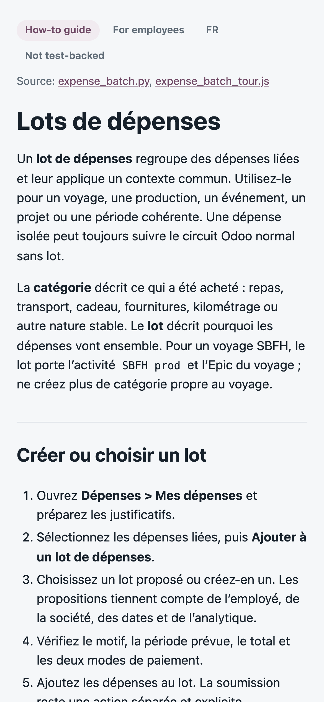

# Built-in user guide screenshots

Captured 8 September 2026 on an isolated, disposable local database
(`odoo_action_risk`, the tracked action-risk closure rebuilt for this branch),
as the non-admin user `qa.docs.reader`, an internal user carrying only the
base user group. No production data, credentials, real contacts, browser
address bars or local paths are shown. Each PNG carries only IHDR, IDAT and
IEND chunks, with no text or EXIF metadata.

The images were captured with `qa-screenshot.mjs` (headless Chrome over CDP)
after the `usl_docs` viewer replaced the accounting module's controller. They
illustrate the pull request `feat(docs): generate the user guide from tests
and serve it with the release`; the behaviour itself is proven by the
`usl_docs` test suite.

## The guide's landing page, desktop

`qa.docs.reader` opens Help from the user menu on a 1440x900 viewport. The
navigation groups pages in Diátaxis order (tutorial, how-to guides, reference,
explanation), French pages carry an `FR` badge, and the landing page is the
generated index: the generated-file notice it starts with is not rendered.

## A hand-written how-to, desktop

Same user opens the French expense-batch guide. The header strip reads the
page's front matter: type, audience, language and the evidence pill, which
says "Not test-backed" because no journey proves this page yet. The source
links point at the repository files the page is about, at the running release.

## The same how-to, mobile

Same page on a 390x844 viewport. The content comes first and the pills wrap;
the navigation follows the page instead of pushing it below the fold.

