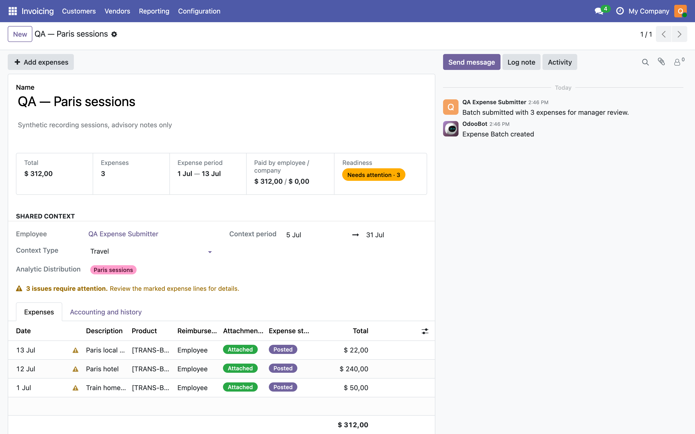
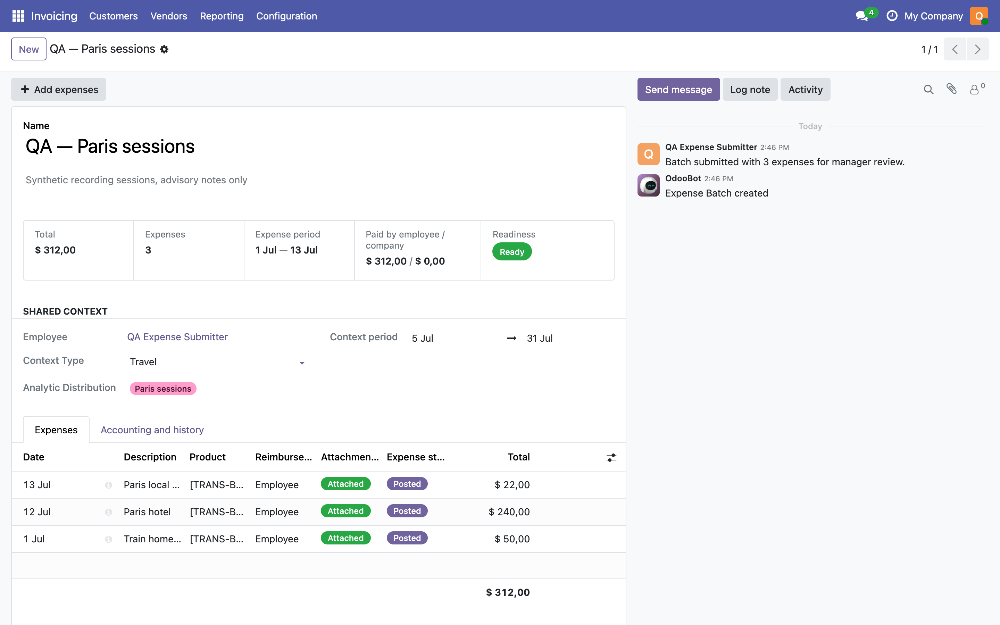
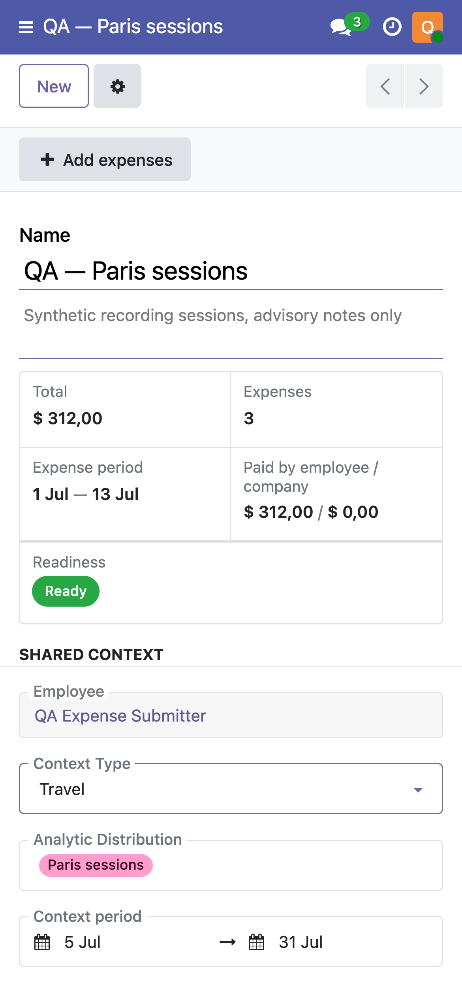

# Expense Batch readiness screenshots

Captured 8 September 2026 on an isolated, disposable local database
(`odoo_fb_banner`) seeded by a throwaway QA fixture script, as the non-admin
user `qa.banner.manager` (an internal user with the base, Expense-manager and
Accounting-manager groups). No production data, credentials, real contacts,
browser address bars or local paths are shown. Each PNG carries only IHDR,
IDAT and IEND chunks, with no text or EXIF metadata.

The same journey was captured on the fixed and the unfixed source: the manager
opens a Batch whose three expenses are all posted and which carries three
advisory notes, all of them "same receipt already used" — the note a
deliberate VAT split produces — and one of them also "outside the Batch
dates".

## Desktop, before the fix

Readiness reads an amber "Needs attention · 3", and an amber banner says
"3 issues require attention. Review the marked expense lines for details."
above a list where every line is already Posted. Nothing on the screen can be
acted on, and no posting button exists, so the Batch reads as blocked when it
is finished.

## Desktop, after the fix

Same Batch, same user, same viewport. Readiness reads a green "Ready" and the
banner is gone. Each line keeps its note behind a neutral information icon,
so the advice is still one hover away without claiming the Batch is unfinished.

## Mobile, after the fix

Same Batch on a 390x844 viewport. The Readiness card reads "Ready" and no
warning band sits between the shared context and the expense list.

