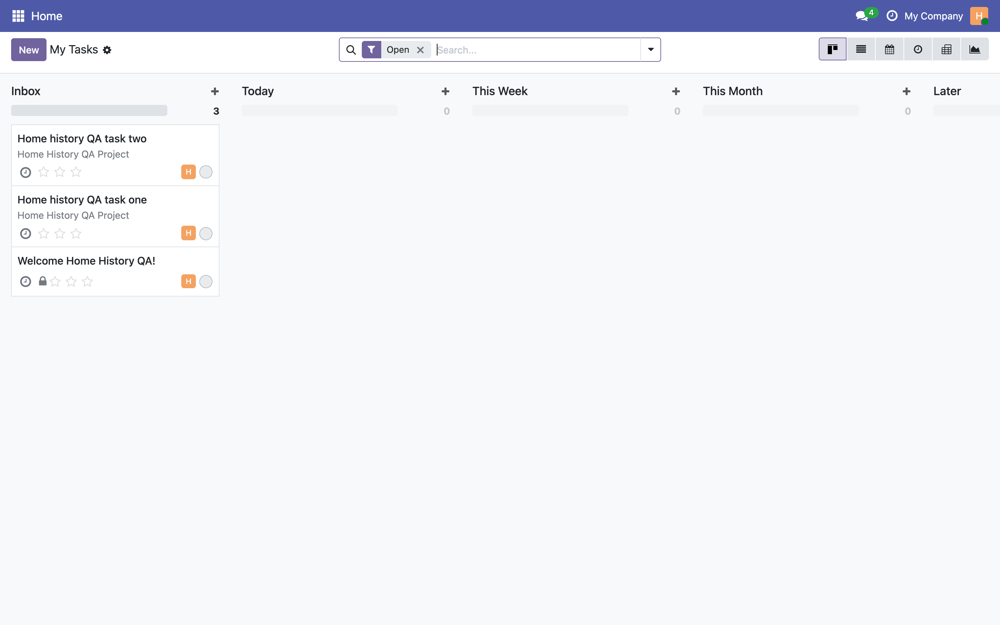
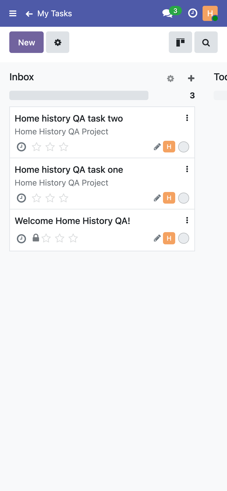
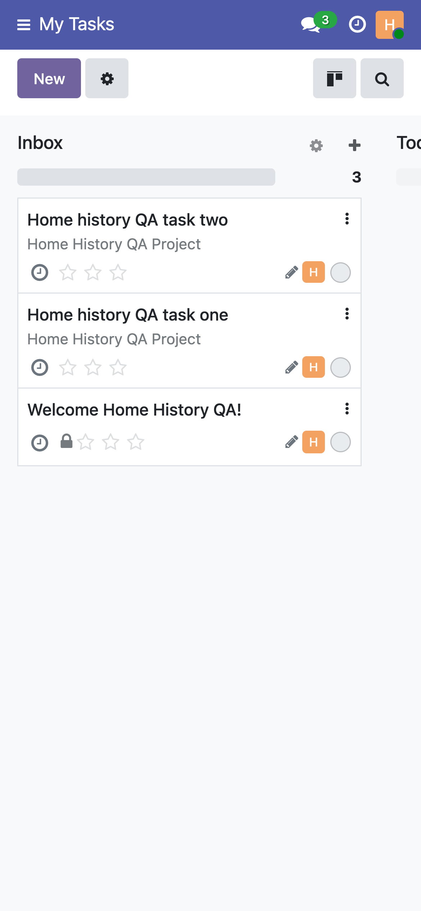

# Home shortcut breadcrumb screenshots

Captured 8 September 2026 on an isolated, disposable local database
(`odoo_fb_home_history`) seeded by a throwaway QA fixture script, as the
non-admin user `home.history.qa` (an internal user with only the base and
Project-user groups). No production data, credentials, real contacts,
browser address bars or local paths are shown. Each PNG carries only IHDR,
IDAT and IEND chunks, with no text or EXIF metadata.

The images were captured with the same journey on the fixed and unfixed
source, by clicking Home's "Open My Tasks" shortcut, using
`qa-screenshot.mjs` (headless Chrome over CDP). The "before" pair shows the
production defect (card #2520); the "after" pair shows the fix in this pull
request.

## Desktop, before the fix

`home.history.qa` clicks "Open My Tasks" from Home on a 1440x900 viewport.
The breadcrumb reads "Home > My Tasks": the shortcut leaves Home in the
trail, unlike a native menu click.

## Desktop, after the fix

Same user, same shortcut, same viewport. The breadcrumb now reads only
"My Tasks", identical to what a native Project menu click produces.

## Mobile, before the fix

Same shortcut on a 390x844 mobile viewport. The top bar shows a back
chevron next to "My Tasks", the mobile signal that a breadcrumb entry
(Home) still sits behind the current page.

## Mobile, after the fix

Same shortcut, same viewport. The back chevron is gone: "My Tasks" is the
root of the stack, matching a direct menu step.

