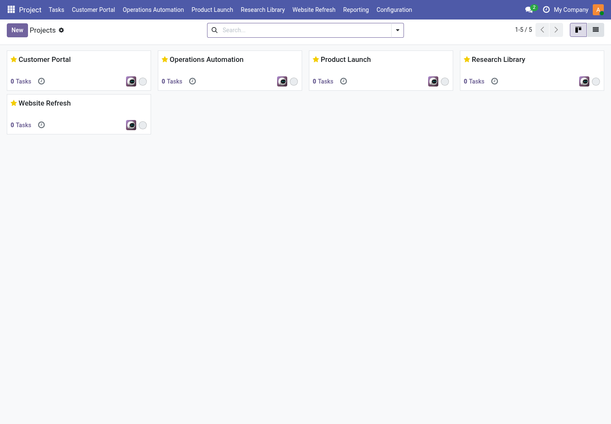
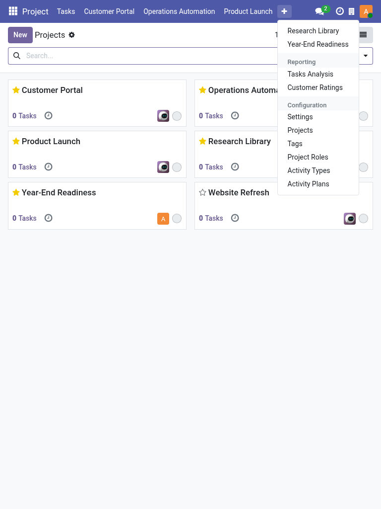
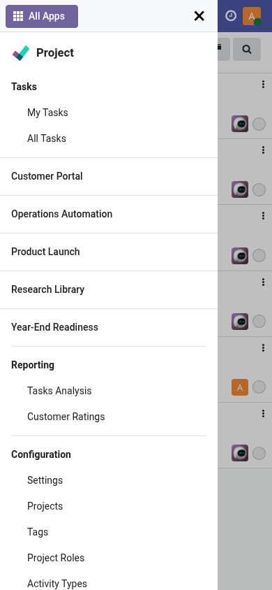
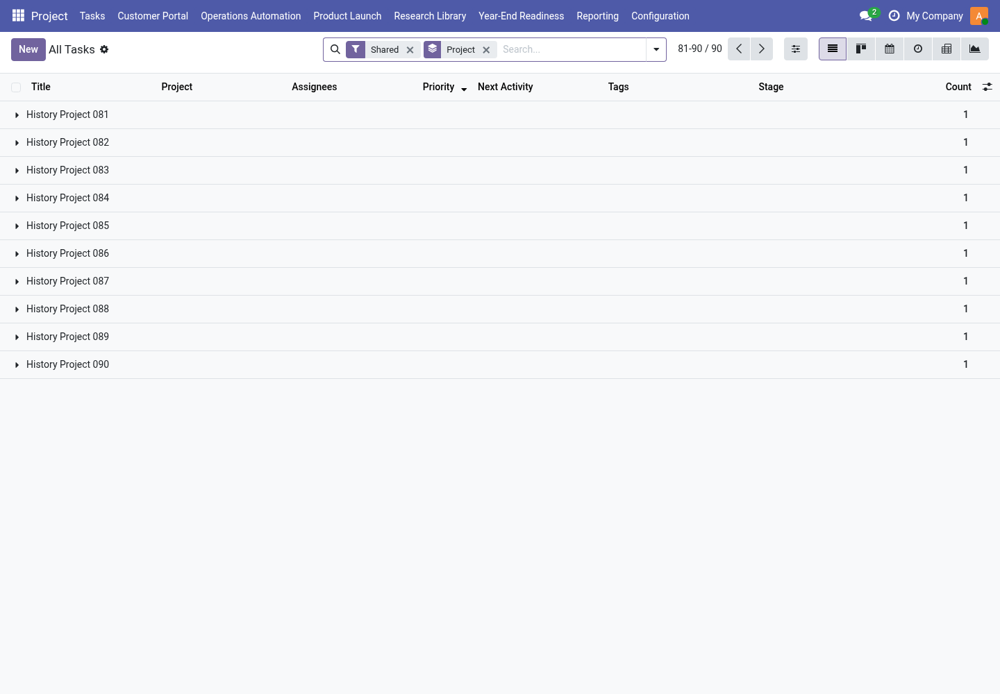

# Navigation review screenshots

These unedited screenshots come from the isolated synthetic Navigation QA
database, captured on 4 September 2026. They illustrate the layouts reviewed for
PR #77. They are not new captures of the final source revision; the final
non-admin browser journey was separately verified on 5 September 2026.

The owner inspected every image before publication. Visible project names,
task rows, avatars and company labels belong to synthetic fixtures or default
Odoo accounts. No production records, real contact details, financial data,
document contents, credentials, browser address bars or local paths are shown.
Each PNG contains only IHDR, IDAT and IEND chunks, with no text or EXIF metadata.
No redaction or image editing was needed.

## Desktop favorites

Favorites sit after Tasks and before Reporting/Configuration. The Project app
entry remains the overview; the redundant first Projects item is absent.

## Tablet overflow

The native More menu keeps the remaining favorites readable. This capture
follows a same-count favorite replacement: Year-End Readiness has replaced
Website Refresh.

## Mobile favorites

The native application drawer keeps named favorites and section headings
readable, with scrolling for lower entries.

## Restored task list

The restored view shows the Shared domain facet, Project grouping, Priority
ordering and page 81–90/90. The screenshot demonstrates the visible state;
automated tests and the separate browser journey verify history behavior.

