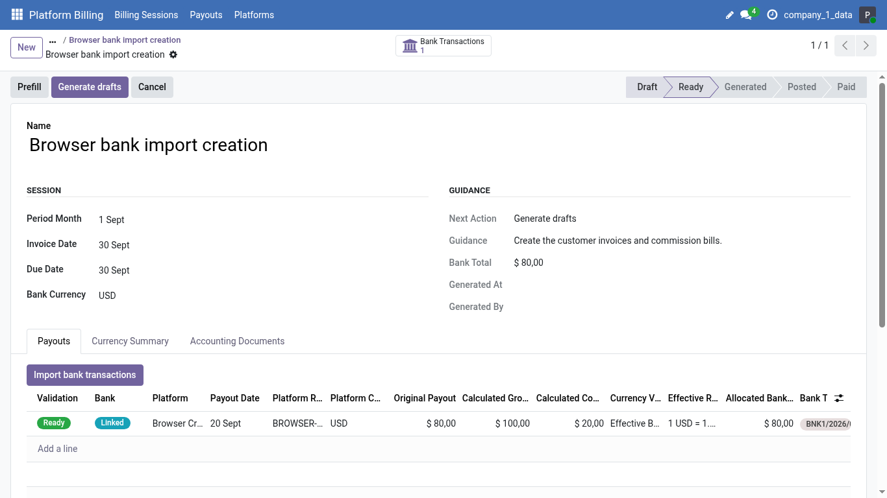

# Bank import QA

Captured 2026-09-06 on the bank-import/zero-commission fix, using a disposable
local database and the non-admin Platform Billing operator fixture. All names,
amounts, documents and companies are synthetic.

The browser tour changes the candidate filter to Suggested only and back to All
open, imports an unmatched receipt, completes its platform/reference/net amount,
and checks the session. Python assertions verify the resulting payout, bank
allocation, valuation mode and Ready state. This image illustrates the final
screen; it is not evidence of functional behavior by itself.

The image was personally inspected before publication. It contains no production
data, credentials, real contacts, browser address bar or local paths. Its PNG
chunks contain only image data and dimensions, with no textual or EXIF metadata.
