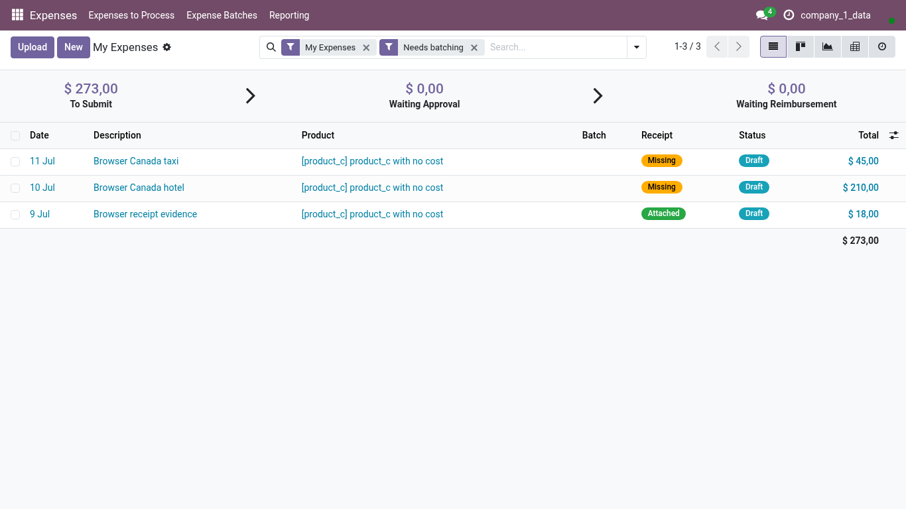
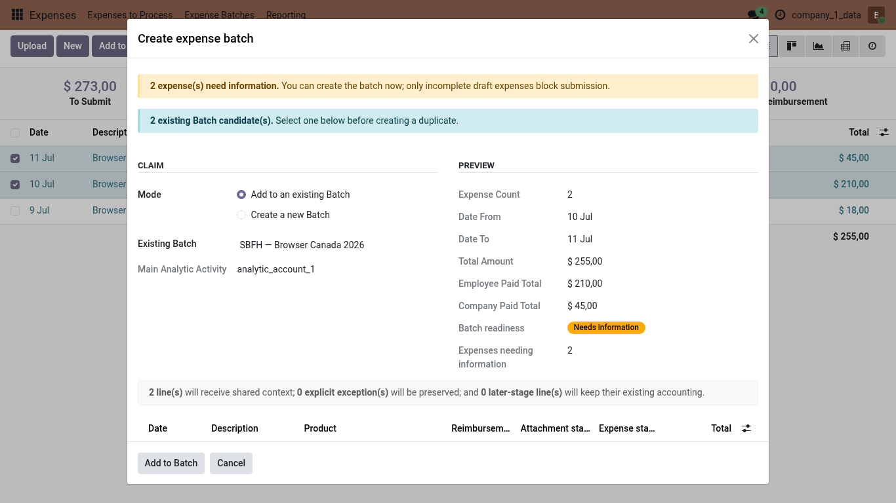
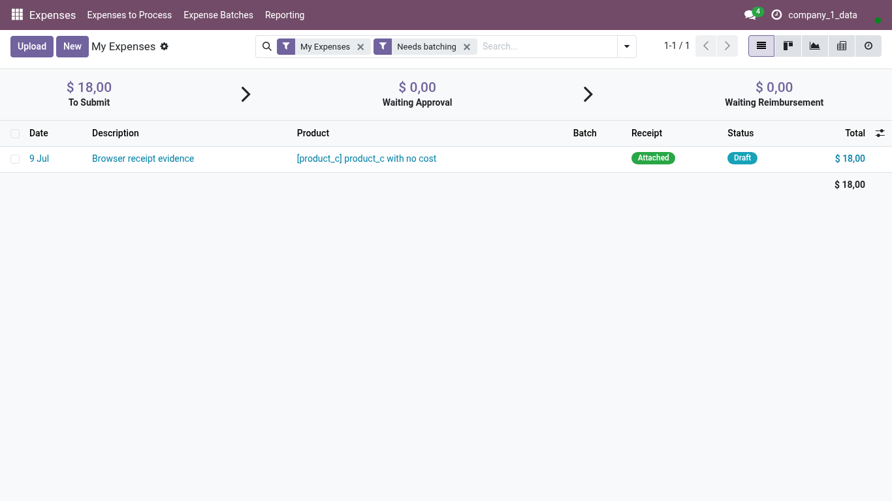

<!-- Generated from the journey named in the front matter. Change the test, then run `make docs`. -->

# Group related expenses into a Batch

Select the expenses that belong together and add them to a proposed Batch so they share one business context.

1. Open **Expenses > My Expenses**. Expenses that belong together, such as a hotel and a taxi from one trip, sit in the same work list.

   

2. Tick the first expense of the trip.

3. Tick the other expenses of the same trip.

4. Choose **Add to a Batch**, the primary action once several expenses are selected.

5. Odoo proposes a compatible Batch from the employee, the company, the dates and the analytics. Keep it, or create a new one.

6. Check the preview: what the employee paid and what the company paid are totalled separately before anything changes.

   

7. Choose **Add to Batch**.

8. The work list no longer shows the grouped lines; they now live on the Batch, where you review and submit them together.

   
